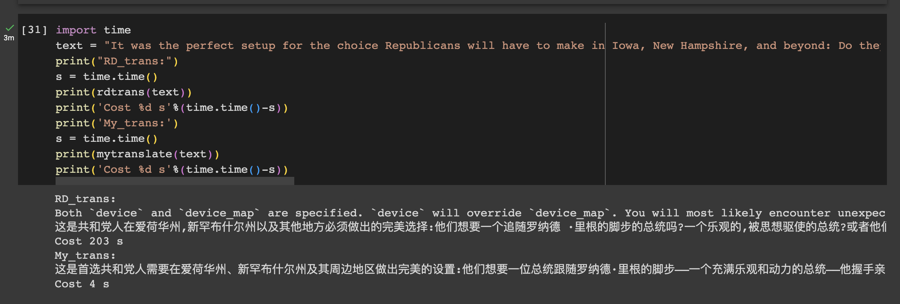

# Translation_en2zh
该模型已在Hugging Face开源：
https://huggingface.co/Jyshen/Translation_en2zh  
---
测试代码：Test_en2zh.ipynb  
训练代码：Train_en2zh.ipynb  
对比试验代码：Comparion_RD.ipynb  

---
预训练模型：https://huggingface.co/Helsinki-NLP/opus-mt-en-zh  
参考代码： https://huggingface.co/DDDSSS/translation_en-zh   
使用数据集：  
- https://huggingface.co/datasets/DDDSSS/en-zh-dataset
- https://huggingface.co/datasets/silk-road/Luotuo-QA-A-CoQA-Chinese
- https://huggingface.co/datasets/silk-road/chinese-dolly-15k
- https://huggingface.co/datasets/silk-road/MMC4-130k-chinese-image
---
## 训练日志:  
  
  

## 对比试验:  
  
  
